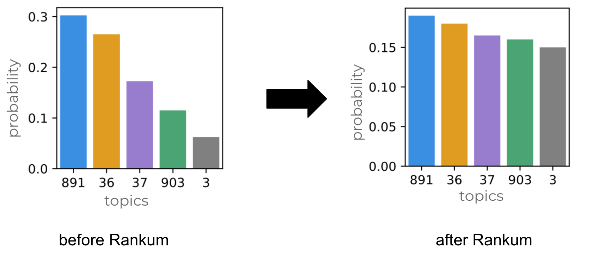

# rankum
Search Rank experimentation in python

## Install
```
pip install rankum
```

## Available features

### Rank diversifiers
Rankum provides features to diversify a search rank (a simple list of documents) by a specified criteria. 
For example, assuming each document in the input list (original rank) is coupled to a topic like a category id, which is very common
in e-commerces. Rankum can help you to diversify the input list to have a more "uniform" distribution of each document 
category.



Rankum implements the following diversifiers:

* [Scores Diff](https://www.researchgate.net/publication/266658487_Using_score_differences_for_search_result_diversification) 
* [MMR](http://www.cs.cmu.edu/~jgc/publication/The_Use_MMR_Diversity_Based_LTMIR_1998.pdf) (coming soon)

##### Examples

```
from rankum import JsonDocReader, ScoresDiffDiversifier 

doc_list = '[
                {"id": 1, "category": 1}, 
                {"id": 2, "category": 1}, 
                {"id": 3, "category": 2}, 
                {"id": 4, "category": 1}, 
                {"id": 5, "category": 3}, 
                {"id": 6, "category": 4}
              ]'  

reader = rankum.JsonDocReader(doc_list)
diversifier = ScoresDiffDiversifier(reader)  
```
```
In: list(diversifier.diversify(by='category'))  
Out:
[Doc(id=1, {'id': '1', 'category': 1, 'score': 2.0}),
 Doc(id=3, {'id': '3', 'category': 2, 'score': 1.333}),
 Doc(id=5, {'id': '5', 'category': 3, 'score': 1.2}),
 Doc(id=6, {'id': '6', 'category': 4, 'score': 1.167}),
 Doc(id=2, {'id': '2', 'category': 1, 'score': 1.0}),
 Doc(id=4, {'id': '4', 'category': 1, 'score': 0.583})]

```


### Document readers
It is possible to read ranked document list from different sources:

* Json
* Elasticsearch (to be implemented)
* Solr (to be implement)
* Text files (to be implemented)
* Pandas dataframes (to be implemented)

